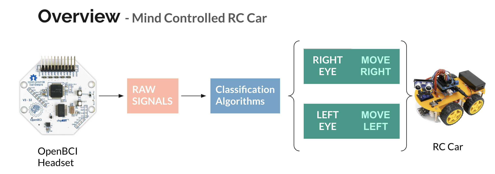
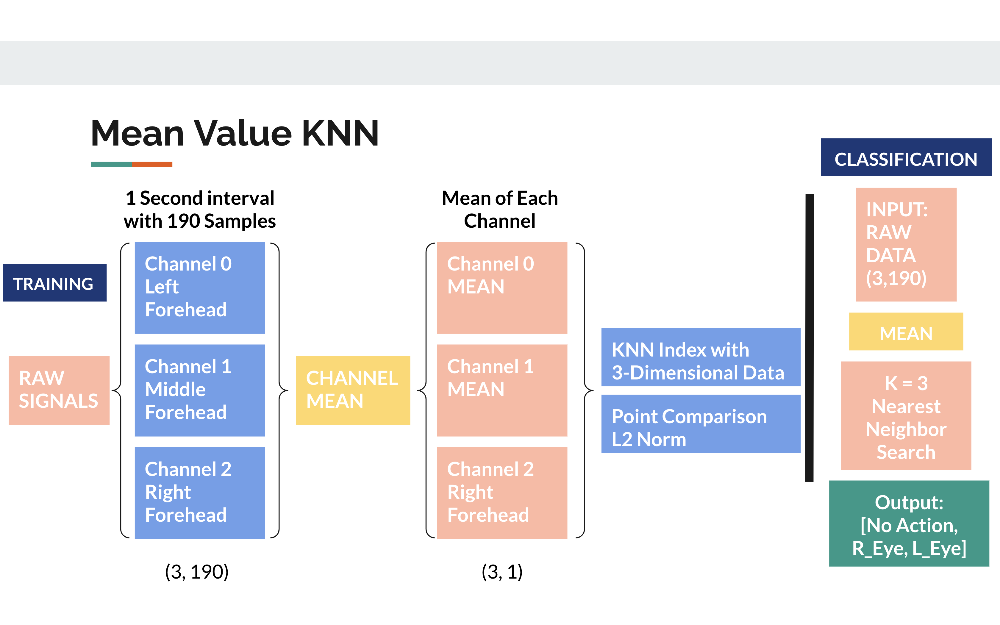

# R-Cario 
### A project by Neurotech@UIUC

# Background Information
This project is an RC Car that can be controlled through facial movements picked up by an EEG device. Currently our RC car supports 2 actions, movement RIGHT and LEFT. These are activated by RIGHT and LEFT eye blinks accordingly. 

 

# Devices Used
- ## OpenBCI 4 Channel Headset
    - #### We only used 3 channels
    - #### Node Placement (Locations on Forehead): 
        - #### Left: Channel 0
        - #### Middle: Channel 1
        - #### Right: Channel 2

- ## RC Car: Lafvin Smart Robot Car Kit
    - #### Used Default Kit to Build Car
    - #### Recieved Singals through bluetooth from a computer to perform respective actions

# Module Structure
- ## This whole system consists of 3 Submodules:
    - ### Training / Classification
    - ### EEG Live Stream
    - ### RC Car Controller

## Training / Classification Approaches
When working on this project, our whole team was very new to working with EEG data. We did not have much experience with EEG devices, recording clean data, or analyzing EEG specfic signals. 

To break down this task, we first spent the first month researching various approaches used in research and industry for signal classification and EEG data. 

We found and read papers on Neural Network based methods, Clustering Algorithms, and different signal transformations. However, after our research the methods we decided to expirement with were:

- **KNN on Raw Data** (Decided to use this due to accuracy and efficiency after testing)
- CNN on Spectogram Images of Data
- Neural Network on FFT Data

## Datasets
We decided to record our own dataset to control the RC Car because, we had a very limited EEG that would not correlate well with professional datasets. We setup the channels on the forehead locations described above. Our data was record in 5 minute sessions for different actions (Left Foot, Right Foot, Left Eye, Right Eye). 

To record data we created a script that would instruct the user when to perform an action using a beep at random intervals. This script can be found at "Training/record.py". To record 5 mins of labeled data, you can use the script like such to get timestamps for actions:

- python record.py --sec 300 --file leftFootTimeStamps

We also recorded the raw data using the OpenBCI Gui. Then to train models, we wrote code to remove outliers in the data, the group the data into 1 second intervals synced with the timestamps for labeled actions recorded. We can then pass this grouped data into various models easily to try different approaces. 

## Classification
Above we mentioned the different approaches we tried, but the highest achieving method was actually just a K Nearest Neighbors Approach. We believe the neural network based methods did not converge due to non optimal recording conditions and lack of a large/robust dataset. 

Here is a diagram outling the KNN approach we used:
 

## How to play around with our code: "python main.py"
Our folder structure is broken down into 4 Main Compenents. There is a folder for ./Training where you can write code to train your models. The models are created in the ./Classifier Folder where each model must extend the abstract Classifier.py class. In ./RC_Controller the code to send bluetooth signals to the RC Car exists. In ./RealTime_Capture the code to read data from an EEG headset exists.

Putting all this together to create our system, the main code exists in main.py. 

A very quick overview of how this works:

- First Import the Necessary Libraries Needed. The following are the different custom modules we wrote. 
    - from Classifier import knn as knn
    - from Training import Datacreate as dc
    - from RealTime_Capture import Capture as capt
    - from RC_Controller import Controller as contr
- RealTime_Capture
    - To use real time capture, one must make sure to call the following functions:
        - EEG = capt.Capture(1, serialPort)
            - This takes in the serial port of the OpenBCI headset and establishes a connection over bluetooth to the device.
        - EEG.startStream()
            - This starts the live data stream from the EEG
        - EEG.getData(n, NUM_SAMPLES)
             - This requests a data read for n secons with NUM_SAMPLES in that interval. 
        - EEG.closeStream()
            - Finally to free system resouces call this function. 
- Model
    - To load a model you write, simply import the module and load it into memory.
    - For example, this is how we imported our custom KNN model and asked for a prediction. The format for most models should be very similar as they all must implement these methods in the abstract class. 
        - model = knn.KNN(3)
        - model.loadModel("combinedKNN")
        - model.classify(data) 
- RC_Controller
    - This module controls the RC_Car
        - controller = contr.Controller(9600, '/dev/cu.HC-06-SPPDev')
            - Here we are initialzing a bluetooth connectino to the RC car at COM port /dev/cu.HC-06-SPPDev
            - 9600 is the bluetooth BAUD rate that we programmed the car at. (Don't worry about this, just use 9600 as the default value for the LAFVIN car kit)
        - controller.connect()
            - This establishes a 2-way connection with the paramters we intialized above. 
        - controller.sendAction(action)
            - Takes in a 1-hot vector of class labels and converts it to a sequence of actions for the RC Car. 
        - controller.close()
            - Free up system resources

Hopefully this helps you understand what we did, so you too can create your own Mind Controlled RC_Car. 

